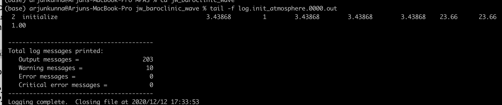
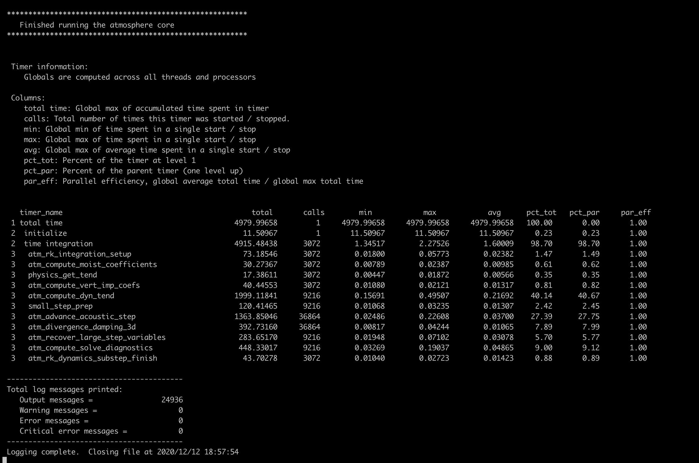
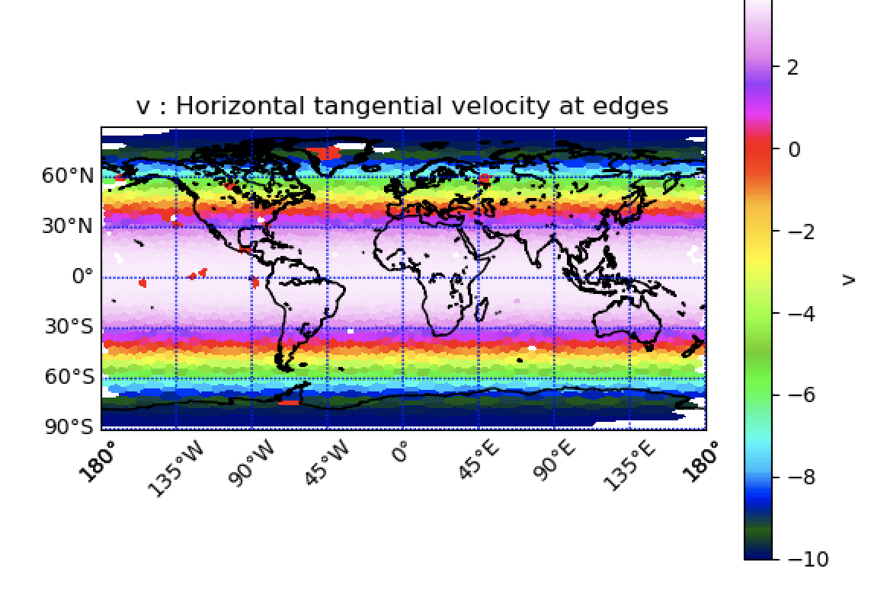

## Resources to learn about MPAS
First, start by going [to the MPAS website](https://mpas-dev.github.io/) and poking around, especially the links about the atmospheric model.

Then, skim through the [tutorial](http://www2.mmm.ucar.edu/projects/mpas/tutorial/Boulder2019/index.html). File 4 in particular is very helpful for understanding the mesh structure.

There is a Google Drive folder with a bunch of PDFs you may find helpful to understand things. The tutorial PDFs are also located there.
The link is [here](https://drive.google.com/drive/folders/1d3mViA53ELeKhiph5kzJndGQwXw7zL_W?usp=sharing).

The [user guide](http://www2.mmm.ucar.edu/projects/mpas/mpas_atmosphere_users_guide_7.0.pdf) is also very helpful. It is also in the google drive. Pages 65-69 are particularly useful for understanding the Voronoi mesh, as well as making sense of the variables in the mesh files. It might also provide some motivation for why we designed the data structures the way we did.

When you get to the stage where you want to understand the MPAS codebase, we have a [tracker](https://docs.google.com/spreadsheets/d/1rf_1s_YfJ-4ThYmug9zu-Pdwg-W61qAWo3WoAsnKXho/edit#gid=79033180) and a [google doc](https://docs.google.com/document/d/1yF4sEZyL1xUkHHfx-uYcRANpZyboRIZo3iiaydksnlw/edit). The google doc is slightly outdated as of April 2021.


## Getting set up on Sapling

First, get Elliott / Prof. Aiken to invite you to Sapling. Follow the instructions [here](https://github.com/StanfordLegion/sapling-guide) to understand how to set up your Sapling account.


## Running regent-mpas in Sapling
After logging on to Sapling, clone the github repo: 
```
https://github.com/alexaiken/mpas-regent.git
```

Then, log onto a node:
```
ssh g0001
```

To run mpas-regent:
```
cd mpas-regent
/home/zengcs/regent ~/mpas-regent/main.rg
```

You have to run this in your `mpas-regent` folder, because we use relative paths to access some of the helper files.
 
Please also add the following to your `~/.bash_profile` so that terra knows where to look for the files we "require". You will need to edit some of the filepaths depending on how you saves mpas-regent.

```
export TERRA_PATH="$HOME/mpas-regent/mesh_loading/?.rg;$HOME/mpas-regent/dynamics/?.rg;$HOME/mpas-regent/?.rg;$HOME/mpas-regent/vertical_init/?.rg"
```

## Helpful tricks for working in Sapling
You can edit files in Sapling directly from VSCode by doing something similar to [this](https://www.youtube.com/watch?v=vpK4rXLc0WY&feature=youtu.be&ab_channel=RyanEberhardt).


## Installing MPAS 
Step 0: Follow the attached script [here](https://drive.google.com/file/d/1l9SuVG6McN817YEMmhxuQuyauPTs6xbP/view?usp=sharing) to install all dependencies. I did all of this locally. It might be easier to go through the steps one by one instead of running the whole script at once, I found that helped me find out where it was going wrong. There are some lines that will need to be changed (mostly around filepaths), I have made notes of that in the script. 

Step 1: Obtain Model source code 

```
git clone https://github.com/MPAS-Dev/MPAS-Model.git
cd MPAS-Model
```

Step 2: Compile MPAS init_atmosphere and atmosphere cores:
```
make -j4 gfortran CORE=init_atmosphere PRECISION=single USE_PIO2=true
make clean CORE=atmosphere
make -j4 gfortran CORE=atmosphere PRECISION=single USE_PIO2=true
```


Step 3: Download the idealized initial conditions: I used the Jablonowski and Williamson baroclinic wave, which is the same one we are trying to use in the Regent implementation

```
wget http://www2.mmm.ucar.edu/projects/mpas/test_cases/v7.0/jw_baroclinic_wave.tar.gz
tar xzvf jw_baroclinic_wave.tar.gz
cd jw_baroclinic_wave
```


Step 4: Link the previously compiled init_atmosphere core (from step 2) and run it:

```
ln -s ${HOME}/MPAS-Model/init_atmosphere_model .  (here, $HOME refers to your top level directory, you can see how I set it in the Dependencies script)
./init_atmosphere_model
```

In another terminal window, if you enter `tail -f log.init_atmosphere.0000.out` you can see its progress, and eventually you should get this output: 


Step 5: Link the previously compiled atmosphere core and run it:

```
ln -s ${HOME}/MPAS-Model/atmosphere_model .
./atmosphere_model
```

This might take a while, perhaps up to an hour. Eventually, you should expect this output:


Step 6: Install ncl following the instructions [here](https://www.ncl.ucar.edu/Download/conda.shtml):
```
conda create -n ncl_stable -c conda-forge ncl
source activate ncl_stable
```

Step 7: Run the bwave_surface_p.ncl script to produce plots of surface pressure each simulated day. 
```
ncl bwave_surface_p.ncl
```
Here is the output from the final timesteps:


The full output it uploaded [here](https://drive.google.com/file/d/1y5W3Cc3nkfvd43yQkYWjXiJX3FsWeSi6/view?usp=sharing).

## Overview of project:

### Mesh loading
If you navigate to MPAS-Atmosphere -> MPAS-Atmosphere meshes, you will find some MPAS meshes. If you download them, you will see that they have a grid.nc file. This contains the mesh data in netcdf format. If you have netcdf installed (you can load it easily on Sherlock), you can manipulate these files and see their contents easy using ncdump. Syntax for ncdump can be found [here](http://www.bic.mni.mcgill.ca/users/sean/Docs/netcdf/guide.txn_79.html#:~:text=The%20ncdump%20tool%20generates%20an,variable%20data%20in%20the%20file.&text=Thus%20ncdump%20and%20ncgen%20can,between%20binary%20and%20ASCII%20representations).

For example, you can do `ncdump x1.2562.grid.nc >> output.txt` to dump the contents of the grid file into a txt file called `output.txt`, and `ncdump -v "latCell"` to dump the contents of variable `latCell`.

We have converted these netcdf files into regent data structures. This was possible because there is a C library to manipulate netcdf files (I think [this is the one](https://www.unidata.ucar.edu/software/netcdf/docs/getting_and_building_netcdf.html). Regent has support for calling C functions, so that is basically what we do to read the grid files into the data structures in `mesh_loading.rg`. Many of the C functions are wrapped in terra functions in `netcdf_tasks.rg`


### Partitioning
In the grid folder that you download, there is a `.graph.info` file. The graph.info files can be partitioned using a software called METIS.

If you'd like to partition the cells into N partitions, you run `gpmetis graph.info N`, which creates a file `graph.info.part.N`. 

This file has `nCells` rows, and each row has a number from `0-(N-1)`, which presumably is the partition that each cell is split into. 

There is a task called `read_file` in `mesh_loading.rg` that parses this graph.info file and returns an array where each element is the partition number of that cell index. We then assign this partition number to the cell and partition in regent based on this.

We also create halo regions around each partition.
`partition_s_1` is the immediate ring around each partition, i.e. 10 neighbour cells
`partition_s_2` is two rings around each partition, so it has the neighbours of all neighbours. I.e. 100 cells.

`partition_halo_1` is just the inner halo, so it is `partition_s_1 - cell_partition_initial`
and `partition_halo_2` is the outer halo, so it is `partition_s2  - partition_halo_1 - cell_partition_initial`.

To understand the halo code, you can read the sections about images and preimages at the [Regent reference] (http://regent-lang.org/reference/).  (And ask any questions that may come up, it's a little confusing).

You can also read about dependent partitioning [here](https://drive.google.com/drive/u/1/folders/1d3mViA53ELeKhiph5kzJndGQwXw7zL_W).

A significant TODO would be to find a better way to do dependent partitioning/haloes - because we require each of the 10^2 neighbours to be values in the cell region for dependent partitioning, our cell data structure has 100 fields which is very messy...


## File by file overview

### main.rg
This is the overview files that calls all of our sub-tasks.

### data_structures.rg
This is the file in which we define our regions. We currently have 4 main regions - a cell region, an edge region, a vertex region, and a vertical region. We find that most variables either are parameterized by a cell, edge, or vertex, while a small number are only a property of the vertical level we are at (hence the need for the fourth region).

### constants.rg
We declare constants here for use in other file.

### mesh_loading/mesh_loading.rg
This file has the task to load the data from the netcdf grid file. 

task `load_mesh`: This loads the data from the netcdf grid file. You can change the grid name in constants.rg.

task `partition_regions`: This partitions the regions. It works correctly, however I still have not been able to return the partition objects.

task `write_output`: This writes an output file to test that we have read the file correctly. To be called just after load_mesh if verification is required.

task `write_output_plotting`: This writes an output file to test that we have read the file correctly. To be called after running timestep, etc.

### vertical_init.rg/init_atm_cases.rg
This initializes many variables needed before we run the RK timestep (including much of the vertical grid). We currently use the Jablonowski and Williamson baroclinic wave test case.

### mesh_loading/netcdf_tasks.rg
This is a helper file employed by `mesh_loading.rg` that has the terra wrapper tasks around the C/netcdf functions we use to read the grid file.

### dynamics/dynamics_tasks.rg
This is where the meat of our kernels are. 

### dynamics/rk_timestep.rg
This is the file that contains the logic for taking a time step.


## Plotting
We turn the mesh into a 'patch' using `mpas_patches.py`. 

The file mpas_patches.py is a helper script that is used to create a MatPlotLib ‘patch collection’ of each of the individual grid cells.

We then use matplotlib to plot the 'patch' object. 

The steps to plot the output are as follows:

Step 1: Run `main.rg` to produce `timestep_output.nc`</br>
Step 2: Copy `timestep_output.nc` locally </br>
Step 3: Copy the plotting folder locally from https://github.com/alexaiken/mpas-regent/tree/master/plotting (both files) </br>
Step 4: Put the `timestep_output` file in this local plotting folder </br>
Step 5: Run `python mpas-plotting.py timestep_output.nc -v pressure_p` </br>
Step 6: You should get this plot:


  
The plot headers can be edited in `mpas_plot_pressure.py` - in general there is no need to touch `mpas_patches.py`.

More information on plotting with MPAS can be found [here](https://github.com/MiCurry/MPAS-Plotting) (although this is not very comprehensive either).


